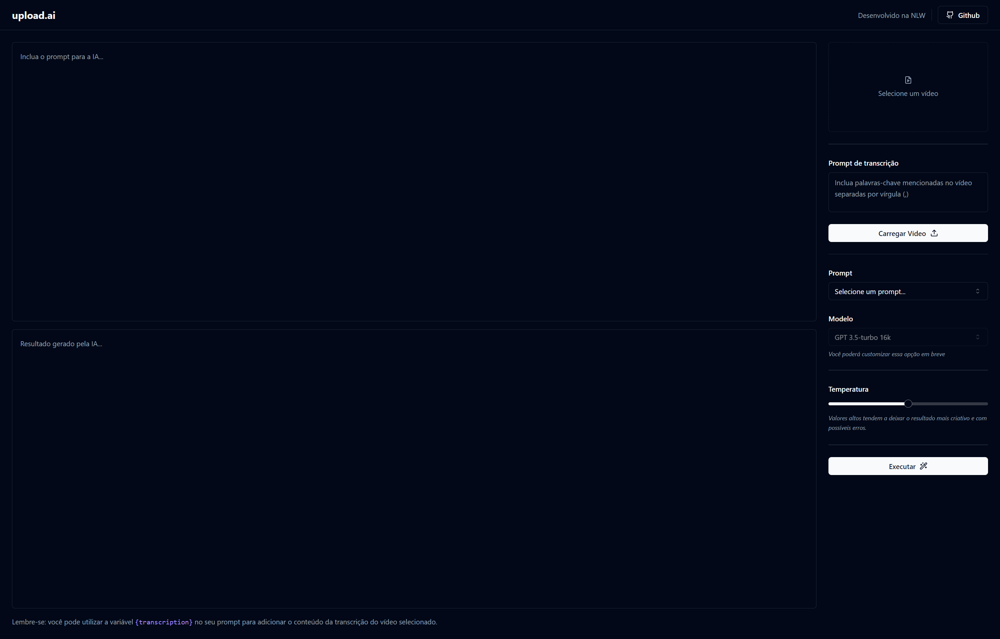

<h1 align="center">Upload.ai</h1>

## 💻 Project 

An AI-driven application that allows users to upload videos and automatically generates optimized titles and descriptions optimized for maximum visibility and engagement.
The project was developed during the RocketSeat NLW. 🚀

  

## 🚀 Technologies

Esse projeto foi desenvolvido com as seguintes tecnologias:

- TypeScript/TSX
- React
- Vite 
- TailwindCSS
- Axios
- Fastify
- Node/Pnpm
- Prisma
- Eslint
- OpenAI API
- Lucide-React
- Zod
- Radix-ui
- ffmpeg
- Git & GitHub

## 📚 Documentation

### upload-ai-web (Frontend
The Front end, built with React, offers a user-friendly interface for generating text. Key features include:

- **User Interface Components**: Includes buttons, text areas, sliders, and more.
- **AI Integration**: Leverages an AI model to generate text.
- **Video Input**: Allows users to upload videos for transcription.

To run the Frontend, clone the repository, install dependencies, and start the server.

### upload-ai-server (Backend)
The server, powered by Fastify, handles video uploads, transcriptions, and AI text generation. Notable features:

- **API Endpoints**: Supports video uploads, transcriptions, and text generation.
- **CORS Configuration**: Enables requests from any origin.

To run the server, clone the repository, install dependencies, and start it on `http://localhost:3333`.

### Getting Started
1. Run both frontend and server components.
2. Upload a video for transcription.
3. Enter a prompt and adjust settings.
4. Click "Executar" to generate AI text.
5. View the generated text.
